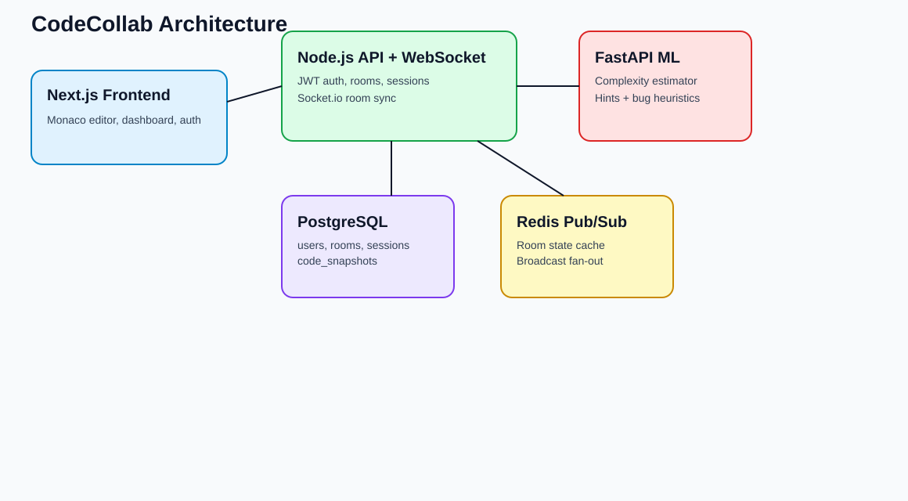

# CodeCollab - AI-Assisted Real-Time Code Interview Platform

CodeCollab is a lightweight LeetCode-meets-Google-Docs interview platform:
- Two users collaborate in a shared Monaco code editor room.
- Code syncs in real-time through Socket.io + Redis Pub/Sub.
- An AI mentor (FastAPI service) provides complexity estimates, bug heuristics, and hints.
- Sessions and snapshots are persisted in PostgreSQL and visualized in a dashboard.

## Live App

- App URL: https://akshat22khanna-codecollab-web.onrender.com
- Deploy from GitHub:
  [](https://render.com/deploy?repo=https://github.com/akshat22khanna/CdeCollab)

## Architecture Diagram



## Stack

- Frontend: Next.js 14, TypeScript, Tailwind CSS, Monaco Editor, Chart.js
- Backend: Node.js, Express, Socket.io, Redis, PostgreSQL
- ML Service: FastAPI (rule-based complexity + hint engine)
- Infra: Docker Compose (web + api + ml + redis + postgres)

## Features Implemented

- JWT auth (register/login/me)
- Room creation and join flows
- Live CRDT-based collaboration with Yjs + language selector
- Redis-backed room state and multi-participant broadcast
- AI analysis panel with 800ms idle-trigger analysis
- Session creation/history endpoints
- Snapshot recording every 30s (configurable) + session replay page (`/session/[id]`)
- Dashboard trend chart for complexity/quality scores

## Local Development

1. Copy env:
```bash
cp .env.example .env.local
```

2. Start infra:
```bash
docker compose up -d postgres redis
```

3. Install and run web+api:
```bash
npm install
npm run dev
```

4. Run ML service:
```bash
npm run setup:ml
npm run dev:ml
```

Frontend: `http://localhost:3600`  
API/WS: `http://localhost:4600`  
ML: `http://localhost:8600`

## Full Container Run

```bash
docker compose up --build
```

## Production Deployment

Use production images and compose:

```bash
cp .env.production.example .env
docker compose -f docker-compose.prod.yml --env-file .env up -d --build
```

Health checks:

```bash
curl http://localhost:4600/health
curl http://localhost:8600/health
```

Deployment details are in `DEPLOYMENT.md`.

## API Overview

- `POST /api/auth/register`
- `POST /api/auth/login`
- `GET /api/auth/me`
- `GET /api/rooms`
- `POST /api/rooms`
- `GET /api/rooms/:id`
- `POST /api/rooms/:id/join`
- `GET /api/sessions/history`
- `GET /api/sessions/:id/snapshots`
- `POST /api/ai/analyze`

## Notes

- This baseline uses last-write room sync; if you want true OT/CRDT next, I can add Yjs in a second pass.
- The ML layer is deterministic/rule-based and structured so GPT hints can be dropped in later.
